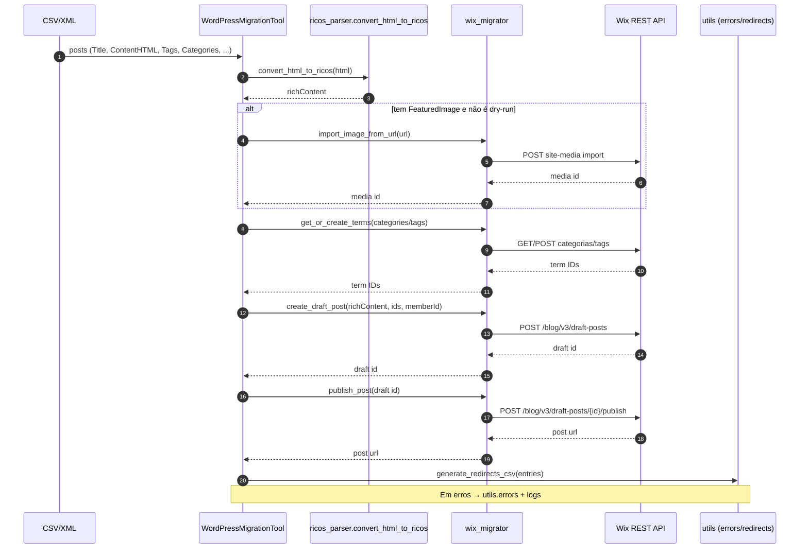

# Diagramas Mermaid — Arquitetura e Fluxos da Migração

Este arquivo reúne diagramas em Mermaid para visualizar os módulos principais e o fluxo de migração WordPress → Wix.

## 1) Arquitetura por Módulos (visão de componentes)

```mermaid
flowchart TD
  %% Grupos de componentes
  subgraph Orquestrador
    Tool["WordPressMigrationTool<br>src/migration_tool.py"]
  end

  subgraph Extractors
    WPCSV["extract_posts_from_csv<br>src/extractors/wordpress_extractor.py"]
    WPXML["extract_posts_from_xml<br>src/extractors/wordpress_extractor.py"]
  end

  subgraph Parsers
    Ricos["convert_html_to_ricos<br>src/parsers/ricos_parser.py"]
    Strip["strip_html_nodes (planejado)<br>src/parsers/ricos_parser.py"]
  end

  subgraph Migrators
    ImportImage["import_image_from_url<br>src/migrators/wix_migrator.py"]
    Terms["get_or_create_terms<br>src/migrators/wix_migrator.py"]
    CreateDraft["create_draft_post<br>src/migrators/wix_migrator.py"]
    Publish["publish_post<br>src/migrators/wix_migrator.py"]
    RL["RateLimiter / with_retries<br>src/migrators/wix_migrator.py"]
  end

  subgraph Models
    WixPostModel["WixPost<br>models/wix_post.py"]
  end

  subgraph Utils
    Errors["errors<br>src/utils/errors.py"]
    Redirects["redirects<br>src/utils/redirects.py"]
  end

  subgraph Scripts
    UpdateDraft["scripts/update_wix_post.py"]
    GetPost["scripts/get_wix_post.py"]
  end

  subgraph Config
    CfgFile["config/migration_config.json"]
    Env["WIX_APP_ID / SECRET / INSTANCE_ID"]
  end

  WixAPI[("Wix REST API")]

  %% Fluxos de dependência/uso
  CfgFile --> Tool
  Env --> Tool

  Tool --> WPCSV
  Tool --> WPXML
  WPCSV --> Tool
  WPXML --> Tool

  Tool --> Ricos
  Ricos --> Tool

  Tool --> ImportImage
  ImportImage --> WixAPI

  Tool --> Terms
  Terms --> WixAPI

  Tool --> CreateDraft
  CreateDraft --> WixAPI

  Tool --> Publish
  Publish --> WixAPI

  Tool --> Redirects

  %% Observabilidade/erros
  Tool --> Errors
  CreateDraft -. erro .-> Errors
  Publish -. erro .-> Errors
  ImportImage -. erro .-> Errors
  Terms -. erro .-> Errors

  %% Integração com modelos e scripts
  Tool -. valida payload .-> WixPostModel
  UpdateDraft --> WixAPI
  GetPost --> WixAPI
```

## 2) Fluxo de Migração de um Post (sequência)

## 3) Observações

- O nó `Strip` (strip_html_nodes) está planejado para habilitar "modo estrito" sem nós `HTML`/embeds.
- `embed_strategy` no parser deve controlar o tratamento de iframes (HTML, vídeo nativo, link).
- Scripts utilitários (`scripts/update_wix_post.py` e `scripts/get_wix_post.py`) interagem diretamente com a API para operações pontuais.
