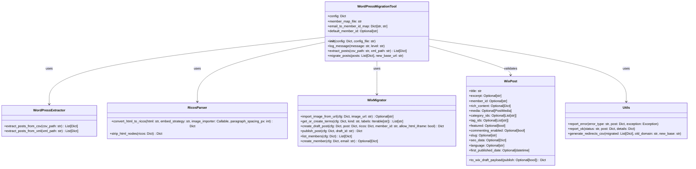

# Novo Diagrama de Classe e Payload

## Diagrama de Classe Atualizado



## Payload Sugerido para Criação de Post no Wix

```json
{
  "draftPost": {
    "title": "Título do Post",
    "memberId": "member-id-aqui",
    "richContent": {
      "nodes": [
        {
          "type": "PARAGRAPH",
          "nodes": [
            {
              "type": "TEXT",
              "textData": {
                "text": "Conteúdo do post em formato Ricos",
                "decorations": []
              }
            }
          ],
          "paragraphData": {
            "textStyle": {
              "textAlignment": "JUSTIFY"
            }
          }
        }
      ]
    },
    "excerpt": "Resumo do post (até 3000 caracteres)",
    "categoryIds": ["categoria-id-1", "categoria-id-2"],
    "tagIds": ["tag-id-1", "tag-id-2"],
    "slug": "slug-do-post",
    "seoData": {
      "title": "Título SEO",
      "description": "Descrição SEO (até 156 caracteres)"
    },
    "media": {
      "wixMedia": {
        "image": {
          "id": "media-id-aqui"
        }
      },
      "displayed": true,
      "custom": true
    }
  },
  "publish": true
}
```

## Explicação do Payload

1. **draftPost**: Objeto principal que contém todos os dados do post
   - **title**: Título do post (obrigatório)
   - **memberId**: ID do autor do post (obrigatório)
   - **richContent**: Conteúdo formatado do post em formato Ricos
   - **excerpt**: Resumo do post
   - **categoryIds**: IDs das categorias do post
   - **tagIds**: IDs das tags do post (limite de 30)
   - **slug**: Slug do post
   - **seoData**: Dados para SEO
   - **media**: Imagem de destaque do post

2. **publish**: Booleano que indica se o post deve ser publicado imediatamente após a criação do rascunho

## Recomendações

1. **Tratamento de Erros**: Implementar um mecanismo robusto de tratamento de erros para lidar com:
   - Falhas na criação de membros
   - Erros no upload de imagens
   - Limites da API do Wix (rate limiting)
   - Validação de dados

2. **Mapeamento de Membros**: Manter um mapeamento de e-mails para IDs de membros para evitar a criação duplicada de membros.

3. **Limites da API**: Respeitar os limites da API do Wix usando o RateLimiter implementado.

4. **Validação de Dados**: Validar os dados antes de enviar para a API do Wix, especialmente:
   - Tamanho máximo de campos
   - Formato de datas
   - Estrutura do conteúdo Ricos