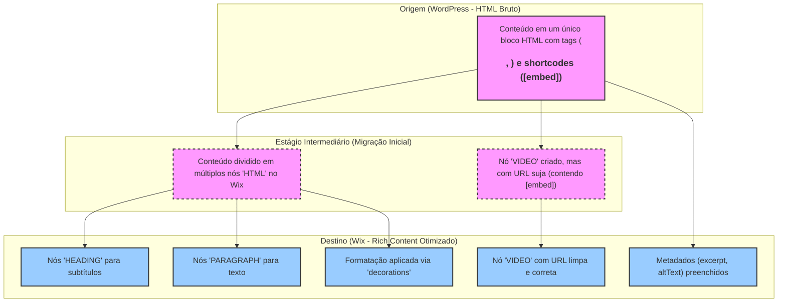

# Análise Detalhada da Migração e Ajuste Fino do Post

## Visão Geral

Este documento apresenta uma análise detalhada das mudanças realizadas durante o processo de migração e ajuste fino do post do WordPress para o Wix, utilizando o caso de estudo `data/posts/case1`.

## Análise Comparativa das Versões do Post

A transformação do post pode ser dividida em três estágios principais, representados pelos arquivos:

1. `old1_...json`: A primeira versão migrada, onde o conteúdo do WordPress foi inserido em blocos `HTML` dentro da estrutura do Wix.
2. `old_...json`: Uma versão intermediária que tentou separar o conteúdo, mas ainda mantinha blocos `HTML` e introduziu um nó de `VIDEO` separado.
3. `585...json` (Final): A versão final e ideal, com o conteúdo totalmente convertido para a estrutura nativa de `richContent` do Wix, eliminando o uso de `HTML`.

## Principais Aprendizados e Padrões de Transformação

### 1. Migração de HTML Bruto para `richContent` Nativo

* **Observação:** A primeira versão (`old1_...json`) continha todo o texto e a estrutura de formatação (cabeçalhos, negrito) dentro de um único e grande bloco de `HTML`. Isso é uma consequência direta de uma importação "copia e cola" do conteúdo renderizado do WordPress.
* **Problema:** Manter o conteúdo como `HTML` dentro do Wix é problemático. Impede a edição visual no editor do Wix, prejudica a indexação por mecanismos de busca (SEO), e não permite que o Wix otimize a exibição para diferentes dispositivos (responsividade).
* **Solução (Versão Final):** O conteúdo foi completamente desmontado e reconstruído usando os nós nativos do `richContent` do Wix, como `PARAGRAPH`, `HEADING` e `TEXT`. A formatação foi aplicada através do array `decorations`.
* **Aprendizado Chave:** A migração não deve ser apenas sobre "fazer o conteúdo aparecer". É crucial converter o conteúdo para a estrutura de dados nativa da plataforma de destino (`richContent` no caso do Wix) para garantir manutenibilidade, performance e SEO.

### 2. Tratamento de Mídia (Vídeos)

* **Observação:** Na versão inicial (`old1_...json`), o vídeo do YouTube estava inserido através de um shortcode `[embed]` dentro do bloco `HTML`. Na versão intermediária (`old_...json`), ele foi extraído para um nó `VIDEO` nativo, mas a URL ainda continha o shortcode (`"url": " [embed]https://...[/embed]"`), o que é incorreto.
* **Solução (Versão Final):** O nó `VIDEO` foi mantido, mas a URL foi limpa, contendo apenas o link direto para o vídeo.
* **Aprendizado Chave:** Conteúdo de mídia incorporado (embeds) precisa ser extraído do HTML e convertido para o componente de mídia nativo correspondente na plataforma de destino. As URLs devem ser normalizadas, removendo shortcodes ou wrappers desnecessários.

### 3. Estruturação Semântica (Parágrafos vs. Cabeçalhos)

* **Observação:** O HTML original usava tags `<h3>` para subtítulos. Na conversão final, estes foram corretamente mapeados para nós `HEADING` com `level: 3`. Parágrafos de texto foram mapeados para nós `PARAGRAPH`.
* **Benefício:** Usar nós semânticos como `HEADING` em vez de apenas texto em negrito (`<strong>` dentro de um parágrafo) melhora drasticamente a acessibilidade (leitores de tela) e o SEO, pois os mecanismos de busca entendem melhor a hierarquia e a importância do conteúdo.
* **Aprendizado Chave:** É fundamental analisar a semântica do conteúdo de origem (tags `<h1>` a `<h6>`, `
`, `<li>`, etc.) e mapeá-la para os nós semânticos equivalentes na estrutura de destino.

### 4. Preenchimento de Metadados Essenciais

* **Observação:** A versão final (`585...json`) possui metadados mais completos e refinados em comparação com as versões anteriores.
  * **`excerpt`:** O resumo foi preenchido, o que é crucial para a pré-visualização em listagens de blog e para o SEO.
  * **`altText`:** O texto alternativo para a imagem de capa (`coverMedia`) foi adicionado, melhorando a acessibilidade e o SEO de imagens.
  * **`minutesToRead`:** O tempo de leitura foi calculado e preenchido (`3` minutos), um detalhe que melhora a experiência do usuário.
* **Aprendizado Chave:** A migração de conteúdo vai além do corpo do post. É uma oportunidade para enriquecer e padronizar metadados que podem ter sido negligenciados na plataforma de origem.

## Diagrama do Processo de Conversão

## Conclusão

A análise deste caso prático demonstra que uma migração de alta qualidade do WordPress para o Wix exige um processo de **Transformação, Extração e Carga (ETL)**, e não uma simples cópia. O objetivo final deve ser um conteúdo que se integre perfeitamente ao ecossistema da nova plataforma, aproveitando seus recursos nativos para otimizar a experiência do editor, do usuário final e dos mecanismos de busca.
